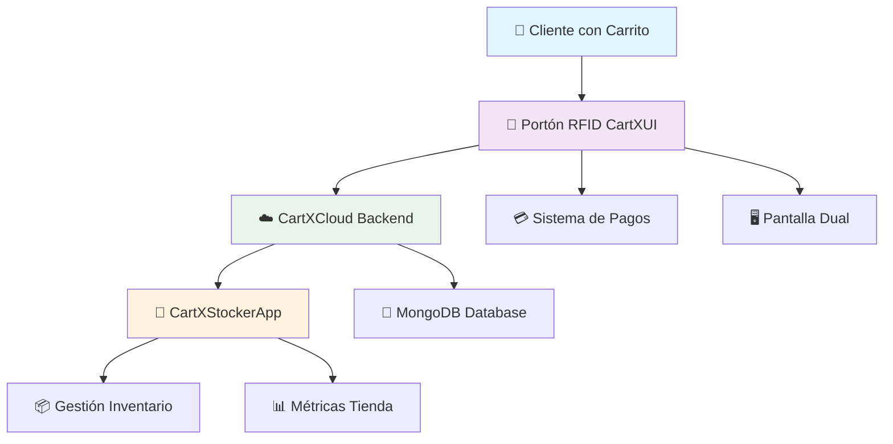

# 🛒 CartX - Sistema de Checkout Automático con RFID

**Trabajo de Fin de Grado - DAM (Desarrollo de Aplicaciones Multiplataforma)**  
**MEDAC Davante Elche | Curso 2023-2025**

---

## 🚀 Introducción

CartX es un **sistema revolucionario de checkout automático** que sustituye las tradicionales cajas de autoservicio por un innovador portón inteligente equipado con tecnología RFID. Los clientes simplemente pasan con su carrito a través del sistema y todos los productos son detectados automáticamente, eliminando la necesidad de escanear manualmente cada artículo.

> **⚠️ Estado del Proyecto:** Work in Progress (WIP)  
> MEDAC priorizó el enfoque del TFG en el proyecto de empresa y no en el desarrollo del software (una pena...), por lo que el código nunca se llegó a terminar.

Este proyecto ha sido creado por [Cristian Olivares (visibait)](visibait.com), Alberto Rodríguez, Carlos Cremades y Fernando Luján.

## 🎯 Características Principales

<table style="width: 100%;">
<tr>
<td style="width: 50%; vertical-align: top;">

### 🔍 **Detección Automática RFID**

- Identificación instantánea de productos
- Sin necesidad de escaneo manual
- Tecnología de vanguardia en retail

### 💳 **Procesamiento de Pagos**

- Integración con múltiples métodos de pago
- Transacciones seguras y rápidas
- Interfaz intuitiva para el cliente

</td>
<td style="width: 50%; vertical-align: top;">

### 📱 **Gestión de Inventario**

- App móvil para reponedores
- Vinculación códigos de barras - RFID
- Métricas en tiempo real

### 🖥️ **Sistema Dual-Screen**

- Interfaz para cliente y operador
- Experiencia de usuario optimizada
- Soporte multi-idioma

</td>
</tr>
</table>

---

## 🏗️ Arquitectura del Sistema

---

## 📦 Repositorios del Proyecto

| Repositorio                                                         | Descripción                              | Tecnologías                             | Estado |
| ------------------------------------------------------------------- | ---------------------------------------- | --------------------------------------- | ------ |
| **[CartXCloud](https://github.com/medac-tfg/CartXCloud)**           | 🌐 Backend principal del sistema         | Node.js, TypeScript, MongoDB, Socket.IO | 🟡 WIP |
| **[CartXUI](https://github.com/medac-tfg/CartXUI)**                 | 🖥️ Sistema del portón con doble pantalla | Electron, React, TypeScript, TensorFlow | 🟡 WIP |
| **[CartXStockerApp](https://github.com/medac-tfg/CartXStockerApp)** | 📱 App móvil para reponedores            | React Native, Expo, TypeScript          | 🟡 WIP |

---

## 🛠️ Stack Tecnológico

### Backend & Database

### Frontend & Mobile

### AI & Hardware

---

## 🎬 Demo del Sistema

_Aquí próximamente aparecerá un video conceptual del sistema CartX en funcionamiento_

### 🔄 Flujo de Usuario

1. **🚶‍♂️ Entrada:** El cliente se acerca al portón con su carrito/cesta o con los productos en la mano
2. **🔍 Detección:** Los sensores RFID identifican automáticamente todos los productos
3. **📊 Procesamiento:** El sistema calcula el total y muestra los artículos en pantalla
4. **💳 Pago:** El cliente selecciona su método de pago preferido
5. **✅ Salida:** Transacción completada, el cliente puede marcharse

---

## 📈 Características Técnicas Destacadas

| Característica              | Descripción                                 | Beneficio                                  |
| --------------------------- | ------------------------------------------- | ------------------------------------------ |
| **🔄 Real-time Updates**    | Socket.IO para actualizaciones instantáneas | Sincronización perfecta entre dispositivos |
| **🎯 Multi-tenant**         | Soporte para múltiples tiendas              | Escalabilidad empresarial                  |
| **🔒 Precisión Financiera** | Biblioteca big.js para cálculos exactos     | Eliminación de errores de redondeo         |
| **🌐 Multi-idioma**         | Soporte para 6 idiomas                      | Accesibilidad global                       |
| **🤖 IA Integrada**         | TensorFlow para detección de presencia      | Experiencia de usuario inteligente         |

---

## 🎓 Contexto Académico

### 📚 **Trabajo de Fin de Grado**

**Grado Superior en Desarrollo de Aplicaciones Multiplataforma (DAM)**

🏫 **Centro:** MEDAC Davante Elche  
📅 **Período:** 2023-2025  
🎯 **Objetivo:** Desarrollar un sistema completo de retail automatizado

---

## 📄 Licencia

Este proyecto no se puede redistribuir ni modificar bajo ningún concepto. Los derechos del código pertenecen única y exclusivamente a [Cristian Olivares Canales (visibait)](visibait.com).

---

**⭐ Si te gusta este proyecto, ¡dale una estrella! ⭐**

